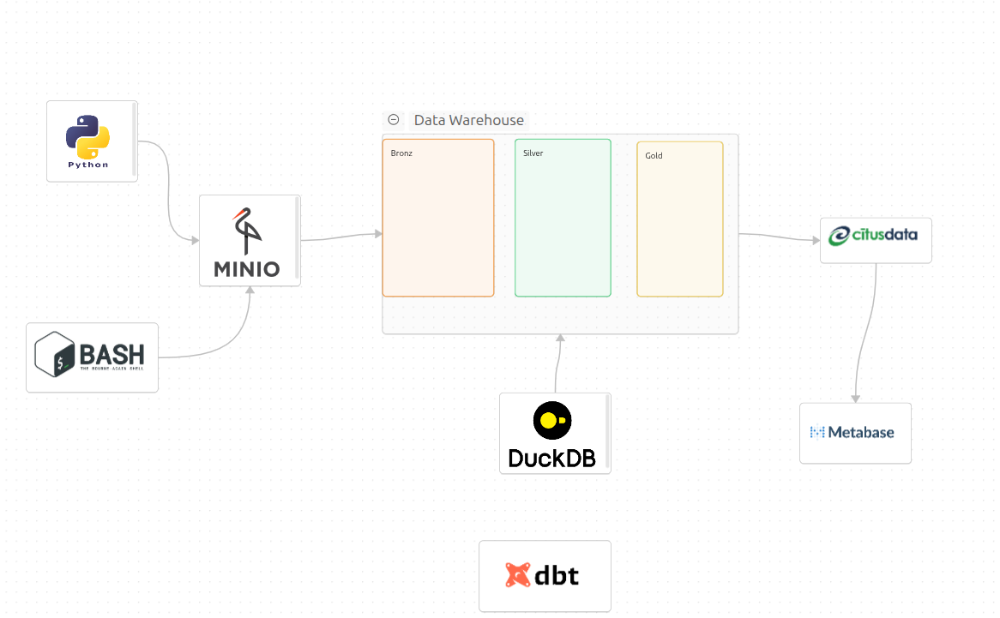

<<<<<<< HEAD
## Data  Pipline 




## Table informations 

```markdown

  | Parquet fayl        | Temp table adı | Description                                             |
| ------------------------- | -------------- | ------------------------------------------------------- |
| Accounts.parquet          | accounts       | Bütün bank hesablarının məlumatları                     |
| AccountStatus.parquet     | accstatus      | Hesabların aktiv, bloklanmış və ya digər statusları     |
| AccountTypes.parquet      | acctypes       | Hesab növlərinin siyahısı (məs: checking, savings)      |
| Addresses.parquet         | address        | Müştəri və ya filial ünvanlarının məlumatları           |
| AddressTypes.parquet      | addrestypes    | Ünvan növləri (məs: ev, iş, poçt)                       |
| Branches.parquet          | branches       | Bank filialları və onların atributları                  |
| Customers.parquet         | customers      | Müştəri məlumatları (ad, soyad, qeydiyyat və s.)        |
| CustomerTypes.parquet     | customtypes    | Müştəri növləri (məs: fərdi, korporativ)                |
| EmployeePositions.parquet | emposition     | İşçilərin vəzifə və mövqeləri                           |
| Employees.parquet         | employee       | İşçilərin məlumatları (ad, soyad, vəzifə, filial)       |
| LoanPayments.parquet      | loanpayments   | Kredit ödənişlərinin detalları                          |
| Loans.parquet             | loans          | Kreditlərin əsas məlumatları (məbləğ, faiz, müddət)     |
| LoanStatus.parquet        | loanstatus     | Kreditlərin statusları (aktiv, ödənmiş, gecikmiş və s.) |

```                                 


Operational metadata 

| Field             | İzah                                                                   |
| ----------------- | ---------------------------------------------------------------------- |
| `file_name`       | Fayl adı (eyni audit ilə)                                              |
| `ingest_time`     | Fayl ingest zamanı                                                     |
| `row_count`       | Fayldakı sətir sayı                                                    |
| `checksum`        | Fayl hash-i (integrity check)                                          |
| `source`          | Mənbə layer (`bronze`)                                                 |
| `status`          | Ingest statusu (success / failed)                                      |
| `error_count`     | Faylda tapılan validation errors sayı                                  |
| `null_rate`       | Hər əsas sütunun null dəyərlərinin faizi                               |
| `duplicate_count` | Fayldakı duplicate rows sayı                                           |
| `schema_match`    | Faylın schema-sının gözlənilən schema ilə uyğunluğu (`true` / `false`) |
| `orphan_records`  | Referenced lookup-larda tapılan orphan rows sayı                       |
| `validated`       | Basic validation tamamlanıb tamamlanmadığı (`true` / `false`)          |


Audit log metadata 
| Field           | İzah                                                              |
| --------------- | ----------------------------------------------------------------- |
| `file_name`     | Oxunan Parquet faylının tam yolu (`s3://bronze/Accounts.parquet`) |
| `ingest_time`   | Faylın ingest olunduğu timestamp                                  |
| `row_count`     | Fayldakı sətir sayı                                               |
| `checksum`      | Faylın hash-i (SHA256 və ya CRC32) → data integrity yoxlamaq üçün |
| `source`        | Faylın mənbəyi (`bronze`)                                         |
| `status`        | Ingest uğurlu olub-olmaması (`success` / `failed`)                |
| `error_message` | Fayl oxunarkən və ya parse zamanı çıxan error mesajı (əgər varsa) |


Ducdb UI ..
https://hub.docker.com/r/kudaw/duckdb-ui
=======
>>>>>>> 4f0e5c2c07f8bafc919082151bd544a2f4f35f74
